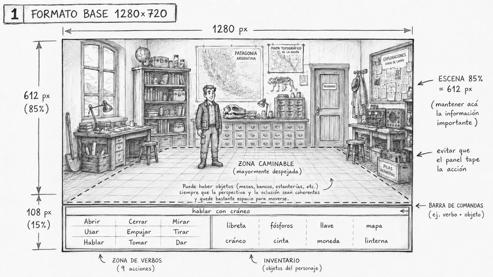
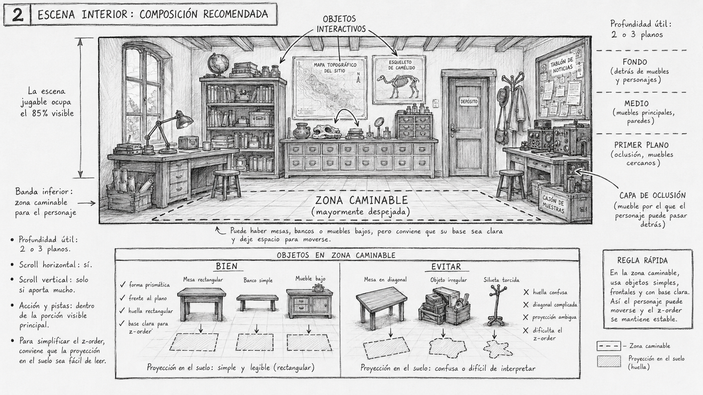
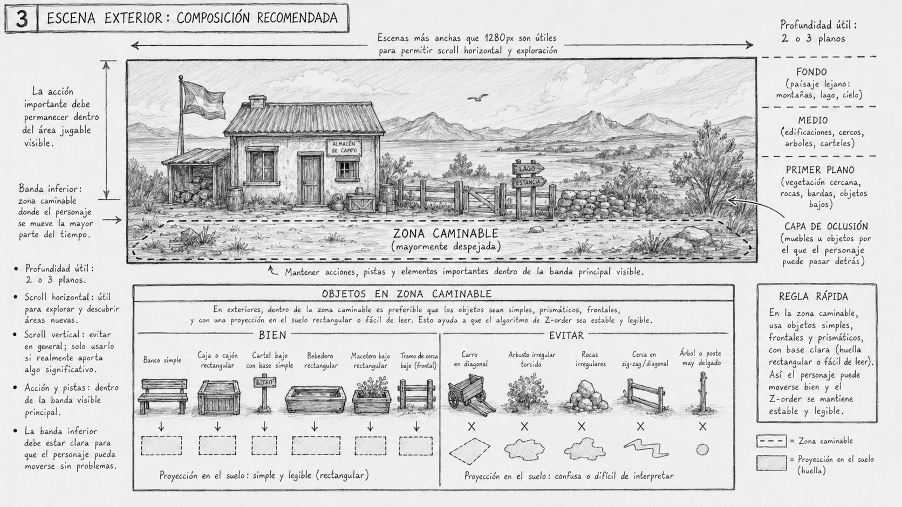
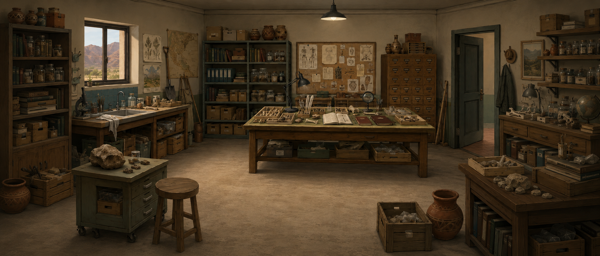
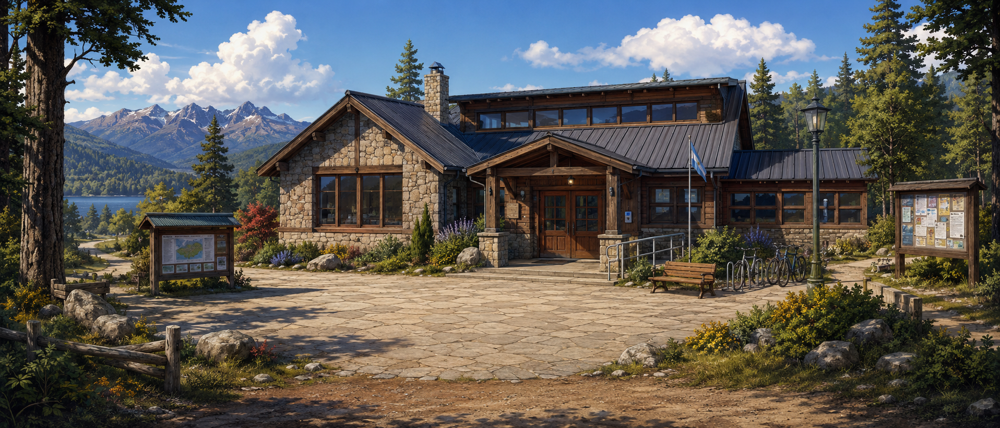

# Fondos y sprites

Cómo diseñar el arte de una aventura point & click: los **fondos** de cada sala y
los **sprites** (personajes, objetos, animaciones). Esta página reúne conceptos,
técnicas y prompts útiles.

!!! note "Estado"
    Esqueleto. Abajo está el índice de lo que cubriremos; el contenido se irá
    completando.

## Conceptos

- **Resolución virtual y escala.** Todo el arte se diseña a la resolución del
  juego (manifest `resolution:`) y el motor lo escala con letterbox/pillarbox.
- **Capas de fondo (layers).** Una sala es un conjunto de capas: cielo, fondo,
  decorados, *occluders* (muebles que tapan al avatar). El orden lo da `z`.
- **Punto de apoyo (anchor "feet").** Los sprites de personaje se anclan por los
  pies para que el escalado y la profundidad funcionen.
- **Paleta y coherencia.** Mantener una paleta y un nivel de detalle consistentes
  entre salas.

## Diseñar un fondo

La resolución de diseño recomendada y establecida por defecto es 1280x720 píxels, de los cuáles un 15% se destina al panel de verbos + inventario.

El motor admite scrolling, y es recomendado usar esta capacidad, especialmente en el modo horizontal.

Para el diseño vertical, se recomienda que todo lo que es de interés en una escena esté dentro de los 612 píxeles (85%).

### Lineamientos para composición de escenas interiores

### Lineamientos para composición de escenas exteriores

## Diseñar sprites y animaciones

> **TODO:** convención de poses (parado/caminando × 4 direcciones), número de
> frames, tamaño relativo al fondo, anclas.

## Técnicas de generación (modelos de difusión)

Los generadores de imágenes (ChatGPT y otros) son un buen punto de partida, pero
su salida hay que **limpiarla**: no producen transparencia real, no respetan una
grilla fija y dejan artefactos.

Flujo recomendado:

1. Generar la imagen (fondo u hoja de sprites).
2. [Transparentizar](../authoring/tools/transparentizer.md) si necesitas alpha real.
3. [Empaquetar la hoja de sprites](../authoring/tools/spritesheet-packer.md) para
   obtener un atlas limpio + YAML.
4. Colocar las capas con el [editor de salas](../authoring/tools/room-editor.md).

### Prompts útiles

### Fondos

#### Plantilla de referencia para escena interior

~~~
Create a 2D background for a point-and-click adventure game.

CANVAS AND LAYOUT
Resolution: 1280x720 pixels.
Horizontal composition.
The playable scene occupies the upper 85% of the image.
The bottom 15% must remain visually safe for a possible command interface; do not place important narrative information there.
The main action should happen in the visible upper area.

CAMERA AND COMPOSITION
Use a mostly frontal composition with slight depth.
Avoid dramatic perspective.
Avoid extreme camera angles.
The scene should feel like a readable theatrical set.
Use 2 or 3 clear depth planes:
- background: walls, windows, doors, distant decoration
- middle ground: main furniture and interactive objects
- foreground: optional occlusion objects that the character can walk behind

WALKABLE AREA
Include a clear walkable area in the lower-middle part of the scene.
Keep it mostly open.
Objects near the walkable area must have simple, readable bases and clear floor footprints.
Avoid confusing diagonal objects or irregular silhouettes in the walking zone.
Leave enough space for a full-body character sprite to move naturally.

INTERACTIVE OBJECTS
Include several readable interactive objects, but do not overcrowd the scene.
Important objects must be visually distinguishable without looking like UI elements.
Use composition, contrast, lighting, and spacing to guide attention.

VISUAL CLARITY
Prioritize readability over decorative complexity.
Avoid clutter.
Avoid placing important objects at the extreme edges.
Avoid tiny unreadable labels unless they are purely decorative.
Make the scene suitable for hotspots, object examination, and character navigation.

CONTENT
Location: [describe location]
Time period: [describe period]
Mood: [describe mood]
Narrative purpose: [describe what the player should understand from this room]
Key interactive objects: [list objects]
Foreground occlusion objects: [list optional objects]
Doors / exits: [list exits]
Lighting: [describe lighting]
Color palette: [describe palette]

STYLE
Art style: [describe style]
Linework: [describe linework]
Rendering: [describe rendering]
Texture: [describe texture]
Do not use photorealism unless explicitly requested.
Do not include characters unless requested.
Do not include UI, captions, labels, arrows, annotations, or text overlays.
~~~

**Resultado**

#### Plantilla de referencia para escena exterior

~~~
Create a 2D background for a point-and-click adventure game.

CANVAS AND LAYOUT
Resolution: 1280x720 pixels.
Horizontal composition.
The playable scene occupies the upper 85% of the image.
The bottom 15% must remain visually safe for a possible command interface; do not place important narrative information there.
The main interactive action should happen in the visible upper area.

CAMERA AND COMPOSITION
Use a mostly frontal or gently angled composition.
Avoid dramatic perspective.
Avoid extreme camera angles.
The scene should feel readable and stable, like a designed adventure-game set.
Use 2 or 3 clear depth planes:
- background: distant landscape, sky, mountains, forest, lake, buildings far away
- middle ground: main environmental structures, paths, trees, rocks, fences, signs, docks, entrances
- foreground: optional occlusion elements such as bushes, trunks, rocks, railings, or low objects the character can walk behind

WALKABLE AREA
Include a clear walkable area in the lower-middle part of the scene.
The walkable area should be easy to read, using a path, dirt ground, beach, yard, road, platform, dock, or another visually coherent surface.
Keep enough open space for a full-body character sprite to move naturally.
Avoid confusing terrain boundaries or overly irregular ground shapes.

INTERACTIVE OBJECTS
Include several readable interactive outdoor objects, but do not overcrowd the scene.
Important objects should be clearly distinguishable through composition, lighting, contrast, silhouette, or placement.
Use recognizable environmental anchors such as a signpost, gate, shack, vehicle, campfire, ladder, dock, crate, or large distinctive rock.

EXITS AND NAVIGATION
Make scene exits easy to understand.
Exits may be represented by paths, roads, stairs, bridges, gates, dock connections, openings between trees, or visible access points to other areas.
Do not make exits ambiguous or visually hidden.

VISUAL CLARITY
Prioritize gameplay readability over pure landscape spectacle.
Avoid large empty areas with no gameplay purpose.
Avoid overly dense vegetation or clutter that hides interactive zones.
Avoid making the sky or distant scenery dominate the scene too much.
Keep the main action in the middle and lower portions of the image.

CONTENT
Location: [describe exterior location]
Environment type: [forest trail / lakeshore / mountain path / town street / dock / campsite / abandoned yard / etc.]
Time period: [describe period]
Mood: [describe mood]
Narrative purpose: [describe what the player should understand from this place]
Key interactive objects: [list objects]
Main walkable surface: [path / dirt / snow / grass / wooden dock / street / beach / etc.]
Exits: [list exits]
Foreground occlusion objects: [list optional objects]
Lighting: [describe lighting]
Weather: [clear / cloudy / misty / windy / light snow / rain / etc.]
Color palette: [describe palette]

STYLE
Art style: [describe style]
Linework: [describe linework]
Rendering: [describe rendering]
Texture: [describe texture]
Do not use photorealism unless explicitly requested.
Do not include characters unless requested.
Do not include UI, captions, labels, arrows, annotations, or text overlays.
~~~

**Resultado**

Nota: notar error en farol, bicicletas, ventanas del lado derecho. Requiere edición.

## Checklist antes de integrar

- [ ] Resolución y proporción correctas.
- [ ] Transparencia real (sin halos) donde corresponde.
- [ ] Sprites recortados a un frame lógico por celda, con ancla de pies.
- [ ] Rutas lógicas e `id`s estables definidos.

## Ver también

- [Herramientas](../authoring/tools/index.md)
- [Generic 2D concepts](../sources/design/03-2d-game-concepts.md) _(inglés)_
- [Point & click concepts](../sources/design/04-point-and-click-concepts.md) _(inglés)_
