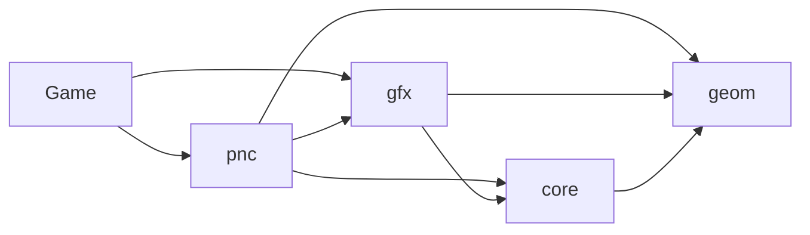
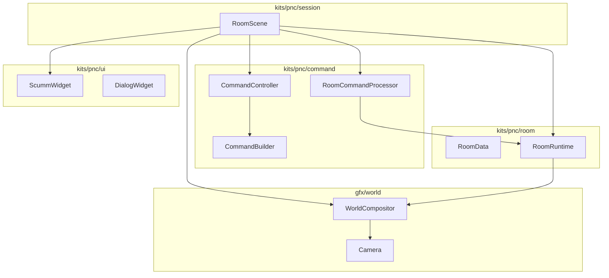

# Code layout and Doxygen

!!! warning "Proposal, not current layout"
    Only the **Current tree** section describes the repository today. The
    target tree and Doxygen setup below have not been implemented.

Directories and namespaces already encode layers (`core`, `geom`, `gfx`, `pnc`),
but each folder is a flat dump. `pnc` in particular mixes command grammar,
room data, rendering, widgets, and the session. That is why `RoomScene` feels
like the whole engine.

Subdivide **folders first**. Keep namespaces stable (`pac::core`, `pac::gfx`,
`pac::pnc`) until a kit rename is worth the include churn. Includes should
eventually read `engine/gfx/world/compositor.hpp`, not `engine/pnc/room_renderer.hpp`
for generic drawing.

---

## Current tree

```
lib/include/engine/{core,geom,gfx,pnc}
lib/src/{core,geom,gfx,pnc}
```



Allowed edges only. `core` must not include `gfx` or `pnc`. `gfx` must not
include `pnc`.

---

## Target tree

Names are indicative. Move files when a promotion lands, not in a grand rename.

```
lib/include/engine/
  core/
    app/          run, Game hooks, EngineContext
    scene/        Scene, SceneManager, factory
    display/      virtual resolution, letterbox
    resources/    Source, Cache, pack
    scripting/    lua_State, scopes, spawn/wait/emit
    state/        StateStore, GameState, SaveService
    audio/
    input/        RoutedInput (today pnc-tinged; belongs here)
  gfx/
    sprite/       Animated / Composite / VisualSprite
    shader/       ShaderChain, RuntimeShaderPass
    world/        camera, viewport, compositor   ← missing today
    scene/        ScriptScene
  geom/           polygons, PIP, pathfinding
  kits/
    pnc/
      command/    Verb, Command, Builder, Controller, Processor
      room/       RoomData, RoomRuntime, persist helpers
      actor/      Avatar façade over gfx sprites
      dialog/
      ui/         ScummWidget, DialogWidget, presentation
      session/    RoomScene orchestrator only
```



Stop condition for a move: a newcomer can find “where verbs live” and “where
sprites live” without opening the session file.

---

## Doxygen — yes, as an index

MkDocs remains the narrative (this tour). Doxygen is the clickable API for
public headers.

Do:

- Generate from `lib/include/engine/**/*.hpp` only.
- `@defgroup core gfx geom pnc` matching folders; later `kits_pnc_command`.
- Brief class comments on types the tour names (`Scene`, `CommandBuilder`,
  `ResourceSource`, …).
- Link Doxygen from the tour (“see `CommandBuilder`”) once a `docs/api` job exists.

Do not:

- Comment every getter.
- Generate HTML for `lib/src`.
- Treat Doxygen graphs as the architecture story. They explode on `RoomScene`.
- Block PRs on missing `/** */` until the include tree is grouped.

A later `Doxyfile` + CI artifact is enough. PlantUML in this tour is optional
for people who already render it; **published diagrams are Mermaid** so MkDocs
Material can show them without a PlantUML server.

---

## PlantUML vs Mermaid

| Use | Language |
|---|---|
| Layers, ownership, folder maps | Mermaid `flowchart` |
| Frame / command / room-change sequences | Mermaid `sequenceDiagram` |
| Long interface lists | Markdown tables in the tour |
| Offline review printouts | Optional PlantUML copies of the same sequence |

If a diagram needs more than one screen, split the chapter. That is the same
rule as “one idea per document.”
