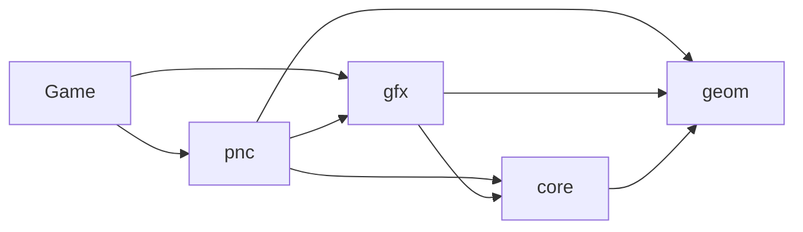
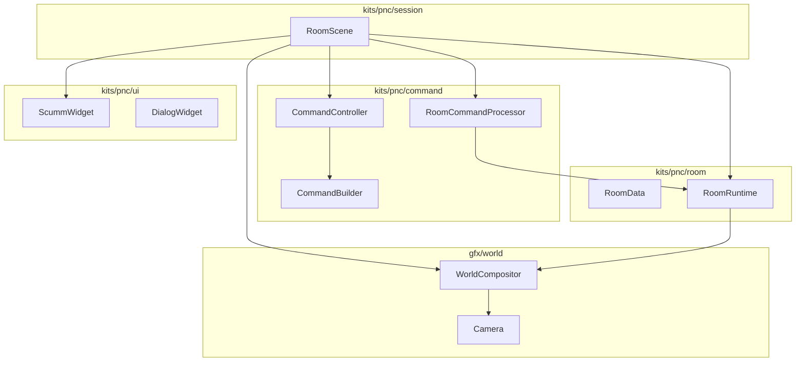

# Code layout and Doxygen

!!! warning "Target layout is a proposal"
    The **Current tree** and Doxygen sections describe the repository today.
    The target tree has not been implemented.

Directories and namespaces already encode layers (`core`, `geom`, `gfx`, `pnc`),
but each folder is a flat dump. `pnc` in particular mixes command grammar,
room data, rendering, widgets, and the session. That is why `RoomScene` feels
like the whole engine.

Subdivide **folders first**. Keep namespaces stable (`pac::core`, `pac::gfx`,
`pac::pnc`) until a kit rename is worth the include churn. Includes should
eventually read `engine/gfx/world/compositor.hpp`, not `engine/pnc/room_renderer.hpp`
for generic drawing.

---

## Current tree

```
lib/include/engine/{core,geom,gfx,pnc}
lib/src/{core,geom,gfx,pnc}
```


```mermaid
flowchart LR
  Game --> pnc
  Game --> gfx
  pnc --> gfx
  pnc --> core
  pnc --> geom
  gfx --> core
  gfx --> geom
  core --> geom
```

Allowed edges only. `core` must not include `gfx` or `pnc`. `gfx` must not
include `pnc`.

---

## Target tree

Names are indicative. Move files when a promotion lands, not in a grand rename.

```
lib/include/engine/
  core/
    app/          run, Game hooks, EngineContext
    scene/        Scene, SceneManager, factory
    display/      virtual resolution, letterbox
    resources/    Source, Cache, pack
    scripting/    lua_State, scopes, spawn/wait/emit
    state/        StateStore, GameState, SaveService
    audio/
    input/        RoutedInput (today pnc-tinged; belongs here)
  gfx/
    sprite/       Animated / Composite / VisualSprite
    shader/       ShaderChain, RuntimeShaderPass
    world/        camera, viewport, compositor   ← missing today
    scene/        ScriptScene
  geom/           polygons, PIP, pathfinding
  kits/
    pnc/
      command/    Verb, Command, Builder, Controller, Processor
      room/       RoomData, RoomRuntime, persist helpers
      actor/      Avatar façade over gfx sprites
      dialog/
      ui/         ScummWidget, DialogWidget, presentation
      session/    RoomScene orchestrator only
```


```mermaid
flowchart TB
  subgraph session ["kits/pnc/session"]
    RS[RoomScene]
  end
  subgraph command ["kits/pnc/command"]
    CB[CommandBuilder]
    CC[CommandController]
    RCP[RoomCommandProcessor]
  end
  subgraph ui ["kits/pnc/ui"]
    SW[ScummWidget]
    DW[DialogWidget]
  end
  subgraph room ["kits/pnc/room"]
    RD[RoomData]
    RR[RoomRuntime]
  end
  subgraph world ["gfx/world"]
    Comp[WorldCompositor]
    Cam[Camera]
  end
  RS --> CC
  RS --> RCP
  RS --> SW
  RS --> RR
  RS --> Comp
  CC --> CB
  RCP --> RR
  RR --> Comp
  Comp --> Cam
```

Stop condition for a move: a newcomer can find “where verbs live” and “where
sprites live” without opening the session file.

---

## Doxygen — implemented as an index

MkDocs remains the narrative (this tour). Doxygen is the searchable,
cross-linked implementation index. See [C++ code browser](../doxygen.md) for the
build command and exact scope.

The implementation deliberately:

- Generates from `lib/include/engine` and `lib/src`. Source definitions are
  necessary to follow `RoomScene` and other implementation-heavy types.
- Exposes private, static, local, and undocumented symbols for code navigation.
- Supports bounded include, inheritance, and collaboration graphs when
  `HAVE_DOT` is enabled locally and Graphviz is installed.
- Disables call/caller graphs because they explode around `RoomScene`.

It does not:

- Generate PDF/LaTeX output.
- Treat Doxygen graphs as the architecture story.
- Warn on every undocumented symbol or block PRs on comment coverage.

---

## PlantUML vs Mermaid

| Use | Language |
|---|---|
| Layers, ownership, folder maps | Mermaid `flowchart` |
| Frame / command / room-change sequences | Mermaid `sequenceDiagram` |
| Long interface lists | Markdown tables in the tour |
| Offline review printouts | Optional PlantUML copies of the same sequence |

If a diagram needs more than one screen, split the chapter. That is the same
rule as “one idea per document.”
