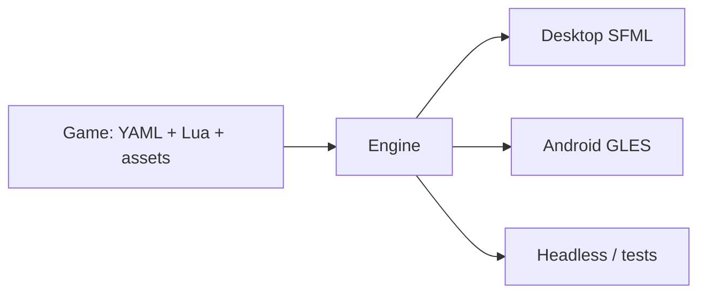
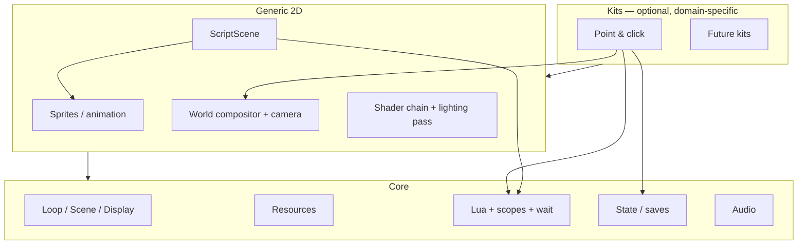

# Design drivers

These rules apply to new work. They are stricter than the historical design
pages. If a change fights a driver, the change is wrong unless the driver is
explicitly revised here.

---

## D1 — Platform-agnostic games

A game is YAML + Lua + assets (+ optional C++ scenes). It must run on every
backend the engine supports (today: desktop SFML, Android GLES) without
game `#ifdef`.

- Virtual resolution and letterbox hide window and density.
- Logical resource paths hide filesystem vs pak vs APK assets.
- Capability queries (`supports_shader_rt()`, audio device present) replace
  platform branches in scenes and scripts.
- Input is virtual-space `RoutedInput`. A one-click Android composer and a
  nine-verb panel are two composers of the same `Command`.

---

## D2 — Engine core + kits, not a P&C engine with leftovers

- **Core** owns process, scenes, resources, Lua scheduler, persistence, audio.
- **Generic 2D** owns sprites, camera/world compositor, shaders.
- A **kit** (today: point-and-click) adds a vocabulary on top: rooms, verbs,
  dialog trees, approach-to-interact. It may keep navmesh / affordance grammar.
- A kit must not grow a private renderer, persist store, or Lua runtime.

`examples/07_script_scene` is the existence proof that a game can skip the kit.

---

## D3 — Lua can author a complete simple 2D game

Every generic 2D capability should have a Lua surface:

| Capability | Must be scriptable without a kit |
|---|---|
| Spawn / animate / composite sprites | yes |
| Camera follow / look-at | yes |
| Input in virtual space | yes |
| Play / stop / fade audio | already core |
| Shaders / time uniform | yes |
| Wait on motion / animation / timer | yes (core wait-board) |
| Persist scalars | already core |
| Layered world draw | yes, once compositor is gfx |

A kit then *adds* verbs, rooms, dialog — still YAML + Lua. Custom C++ scenes
remain valid for minigames; they are not the default path.

Today this driver is only half-true: `ScriptScene` exposes some 2D, rooms expose
more, and neither is a complete 2D Lua API. Closing that gap is core work, not
P&C work.

---

## D4 — Kits make complex games efficient, still data-driven

Fuera de Cuadro should stay a YAML/Lua chapter plus a few registered scenes
(Notebook, Map). The kit exists so authors do not reimplement walkboxes,
affordances, and speech. It does not exist so the engine can absorb game UI.

---

## What the tour is for

1. State the drivers above so PRs have a test.
2. Teach the as-built codebase and its pitfalls so a new developer does not
   start in `room_scene.cpp`.
3. Give enough concepts, interfaces, dependencies, and sequences (diagrams in
   this folder) to plan refactors without a second engine.
4. Propose a folder layout that matches the layers even before files move.
5. Use Doxygen as an *API index* of public headers, not as the narrative.
