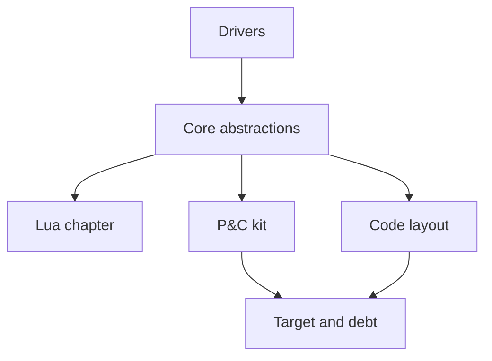

# Architecture tour

This tour has five jobs:

1. **Drivers from now on** — platform-agnostic games; a general 2D engine plus
   optional kits (point-and-click); Lua strong enough that a simple game needs
   no kit; kits make complex games efficient and still YAML/Lua.
2. **Onboard a new developer** — concepts and pitfalls, not `room_scene.cpp` first.
3. **Support refactors** — interfaces, dependencies, sequences, diagrams.
4. **Navigate the tree** — proposed subdivisions under the existing layers.
5. **Index the C++ API** — Doxygen on public headers; this tour stays the story.

Historical pages under [`../design/`](../design/00-index.md) are
[archived](../history/README.md).

---

## Read in this order

| Doc | Job |
|-----|-----|
| [Design drivers](00-drivers.md) | Rules for new work. Start here. |
| [1 — Core abstractions](01-core-abstractions.md) | `Game`, `Scene`, loop, resources, Lua preview. |
| [Point & click kit](07-point-and-click.md) | Commands, session vs widgets, sequences, pitfalls. |
| [Target architecture and debt](target-and-debt.md) | Gap vs drivers; what to extract and in what order. |
| [Code layout and Doxygen](code-layout.md) | Folder split and API index. |

Still to write: Lua in depth, draw pipeline, lighting, persistence, platform.

---

## Three-day onboarding

**Day 1.** Drivers + core. Build the engine. Run `01_hello_room` and
`07_script_scene` (the no-kit path).

**Day 2.** P&C kit. Run `02_scumm_inventory` with `edit_mode` and F4. Submit a
`LOOK_AT` in a headless test.

**Day 3.** One FdC room YAML+Lua pair. Follow `talk`. No feature work.

---

## PR rule

1. Capability, kit policy, or game feature?
2. If a capability, does it live below `pnc` and have a Lua surface (or a ticket)?
3. Does it add methods to `RoomScene`? Default is reject.
