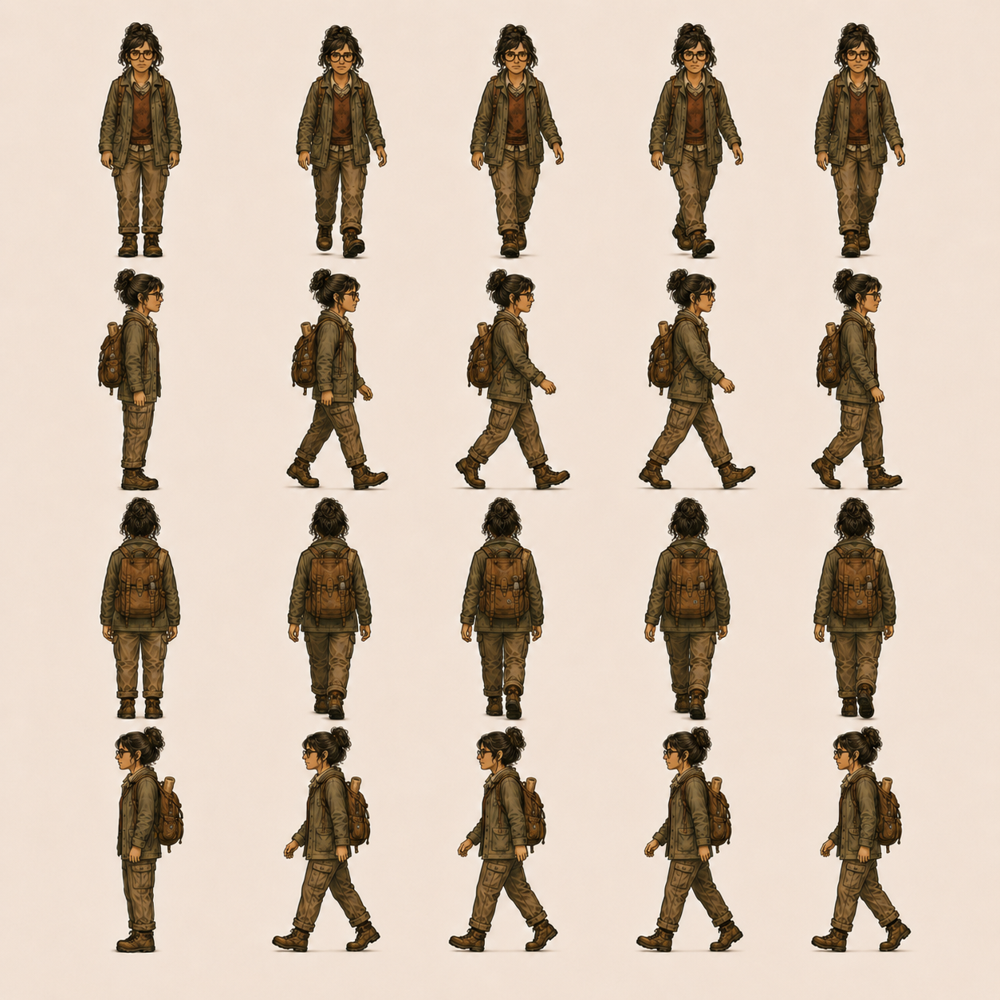
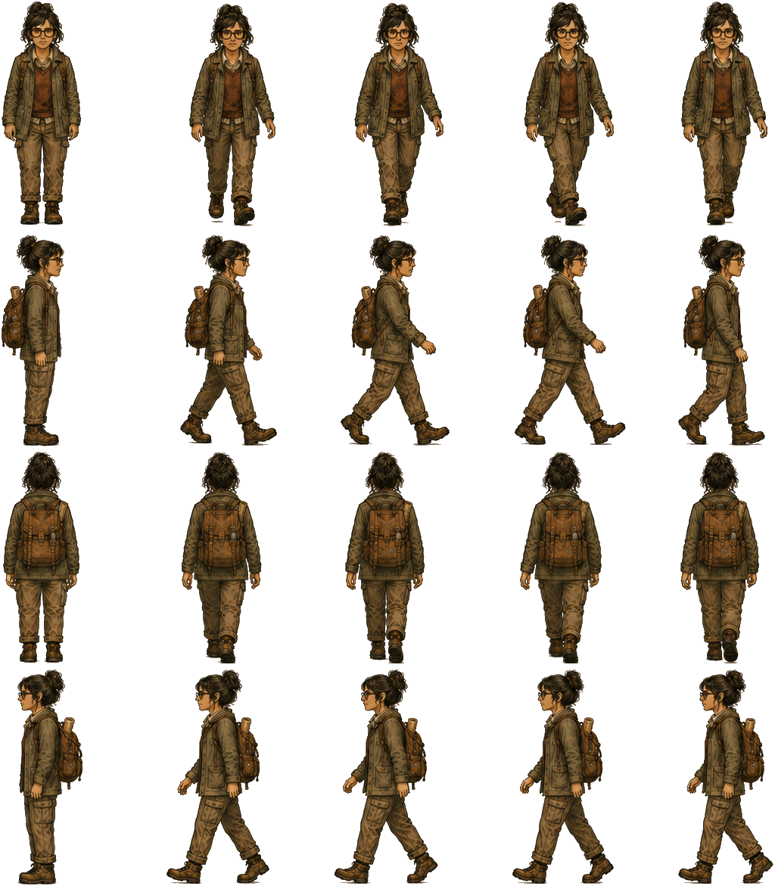
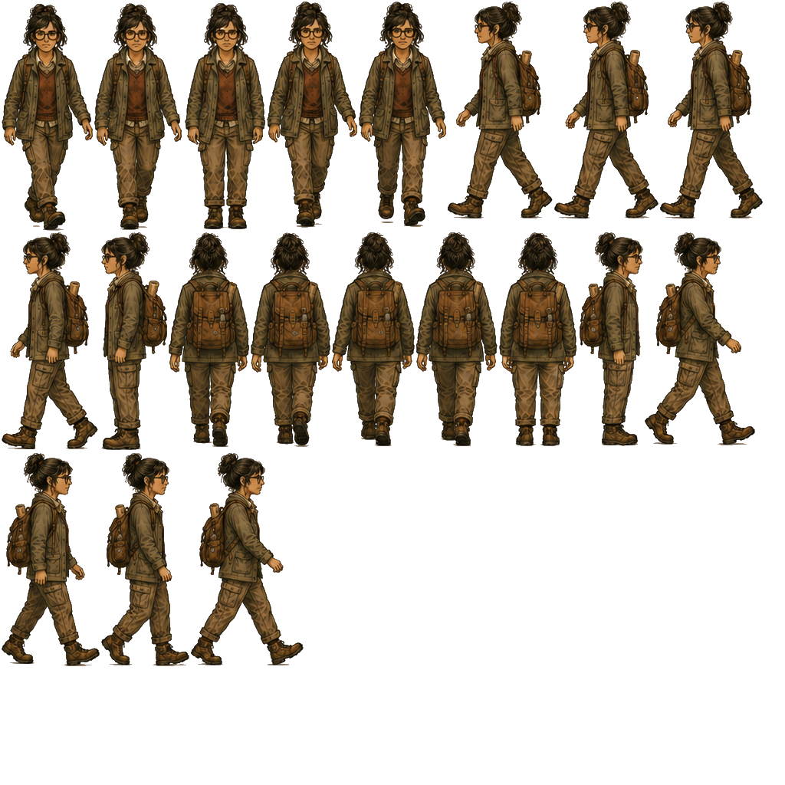

The character processing pipeline
=================================

Once a character spritesheet has been generated in ChatGPT or other tool, the process for obtaining a usable avatar are:

- Step 1. Remove the background.
- Step 2. Name the frames.
- Step 3. Generate sprite atlas.
- Step 4. Generate animation file.

Step 1. Background removal
--------------------------

We start with an original image that in appearance has a solid background, but it doesn't. It contains tone variations:

To remove the background, we use the [transparentizer tool](../../../../tools/transparentizer/README.md).

The output is a transparent image:

The algorithm works as follow:

1. Compute RGB distance between each pixel and chroma key.
2. distance <= hard  → full transparency.
3. distance >= soft  → full opacity.
4. between both → gradual alpha.

Both values should be between 0 and 255, and `--hard` <= `--soft`.

Note: `--key auto` works for most cases. It automatically finds the chroma color from the image edges.

Script: [01_transparentize.sh](01_transparentize.sh).

Step 2. Frame naming
--------------------

Next step is naming frames so that when build a spritesheet each frame is easy to identify.

Example: [julia.txt](./02_frame_namification/julia.txt)

~~~txt
# One row per original spritesheet row.
# Names are read left-to-right, then top-to-bottom.

sf wf0 wf1 wf2 wf3
sr wr0 wr1 wr2 wr3
sb wb0 wb1 wb2 wb3
sl wl0 wl1 wl2 wl3
~~~

Step 3. Packing into a spritesheet + atlas
------------------------------------------

This step packs the sprites back into a single frame, and creates a `.yml` with the rects for each frame using the names of the previous step.

Example files:

- [julia.png](./03_packagification/julia.png)
- [julia.yml](./03_packagification/julia.yml)

Step 4. Creating the animation file
-----------------------------------

See [julia.anim.yml](./04_animification/julia.anim.yml)